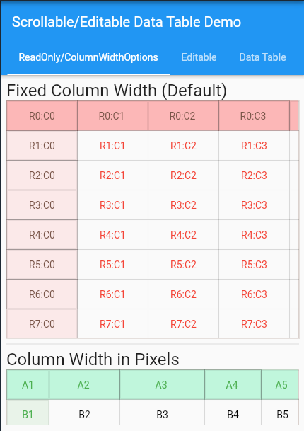
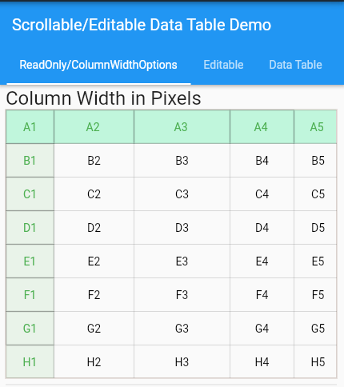
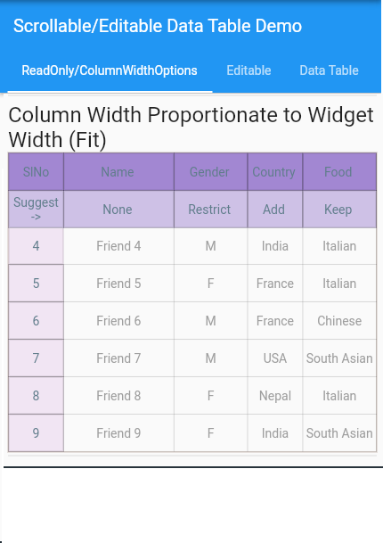
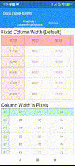
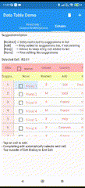

<!--
This README describes the package. If you publish this package to pub.dev,
this README's contents appear on the landing page for your package.

For information about how to write a good package README, see the guide for
[writing package pages](https://dart.dev/guides/libraries/writing-package-pages).

For general information about developing packages, see the Dart guide for
[creating packages](https://dart.dev/guides/libraries/create-library-packages)
and the Flutter guide for
[developing packages and plugins](https://flutter.dev/developing-packages).
-->


# DataSheet Widget with Scroll/Edit/Sort/Select Options

## Description
I was looking for a widget that allows views with fixed header/columns, in-situ editing, locking of cells etc and above all to handle large data.

After searching I did find **horizontal_data_table**, but it still didn't meet the expectations; so thought of developing myself.

This package is the outcome. I hope you find it useful. You are welcome to comment, contribute to improve the package.

## Performance

Have tried it on android mobile as well as on web with 2048 Rows x 512 columns, without noticing any performance issue.
## Features

- Quick and Light Weight widget
- Pin Top-rows/ Left-columns so they are always visible
- In-situ editing
- Auto Scroll to next cell on edit completion
- Dropdown suggestions
- Adjustable Column widths
- Decoration/Style for rows, columns
- Select/deselect cell/rows
- Allows custom widgets as cell content


## Installation

Install data_table

```bash
  flutter pub add data_table
```

## Demo












## Usage/Examples

```dart
import 'data_table/data_table'
/// --------------------------------------
///  Build parametes to be passed
/// --------------------------------------

List<CellSetup> _cellSetups = [
                CellSetup(selected:_selected),
                CellSetup(
                    textInputType:TextInputType.name, 
                    defaultSort: EditAction.sortA2Z, selected:_selected),
                CellSetup(
                    suggestions:_suggestGender, 
                    action:SuggestionsAction.restrict,
                    defaultSort: EditAction.sortNone),
                CellSetup(
                    suggestions:_suggestCountry,     
                    textInputType:TextInputType.name, 
                    defaultSort: EditAction.sortZ2A, 
                    triStateSort:false),
                CellSetup(                          
                    suggestions:_suggestFood,     
                    getWidget: _getCustomeCellWidget,
                    action:SuggestionsAction.keep,  
                    textInputType:TextInputType.name),
                CellSetup(textInputType:TextInputType.number),
                      ];

```
Example of Usage. The utility of parameters is explained along side each parameter. Detailed explanation is given in [Parameter Notes](###-Parameter-Notes)
```dart
/// --------------------------------------
///  The Widget
/// --------------------------------------

DataTable(
    data:_data,                         // List<List<String>>
    onUpdate: onUpdate,                 // callback, refer note below
    onSelectCell:onSelectCell,          // callback
    cellSetups:_cellSetups,             // List<CellSetup>

    isEditing: true,                    // Setting it true/false will make the widget editable/read-only

    outerController: outerController,   // Scroll controller of parent widget (if scrollable), can be null
    outerPhysics: outerPhysics,         // Required in pair with outerController parameter

    pinnedRows: _pinnedRows,            // Pinned top row (int)
    pinnedCols: _pinnedCols,            // Pinned left columns (int)

    cellSize: const Size(100,kToolbarHeight*0.7),

    columnWidths:const [0.15,0.3,0.2,0.2,0.2, 0.2],
    columnWidthOption: ColumnWidthOption.ratio,
    
    decoPinnedRow: [                    // List<BoxDecoration>
                    _decoPinnedRow1,
                    _decoPinnedRow2,
                    ],
    decoPinnedCol: [ _decoPinnedCol1,], // List<BoxDecoration>
    decoNormal: _decoNormalCell,        // BoxDecoration
    stylePinnedRowText: 
        _stylePinnedRowText,    // TextStyle
    stylePinnedColText: 
        _stylePinnedColText,    // TextStyle
    styleNormalCellText: 
        _styleNormalCellText,  // TextStyle
  );
```
### Parameter Notes

**data**: 
- Contains values of all columns & rows in String format. The user shall populate this List converting all the values to String and ultimately List<List<String>> 
```dart
/// Sample of preparing Friends class to pass on to [data]
    _bodyPage3 = _friends.map((e) {
      return [
        '${e.id}',
        e.name,
        e.gender,
        e.country,
        e.food,
        DateFormat('dd-MMM-yyyy')
            .format(DateTime.fromMillisecondsSinceEpoch(e.dobEpoch)),
        e.weight.toStringAsFixed(1),
        e.height.toStringAsFixed(1)
      ];
    }).toList();

```
- **onUpdate**: This is the main callback function the widget calls after the user performs edit, sort operation. The functions passes a dynamic value related to the cell identified by row & column number along with action taken. It is users responsibility to handle the passed value for correctness and updating the same.
```dart
  bool onUpdate(int row, int col, dynamic value, EditAction action) {
    late String str, newValue;
    double? val;
    int count = 0;

    str = '';
    switch (action) {
      case EditAction.add:
        List<String> nl = List.generate(_header1.length, (index) {
          return index == 0 ? '${_dataPage3.length - _pinnedRows + 1}.' : '';
        });
        ...
        ...
        break;
      case EditAction.delete:
        int rowNo = _curRow - _pinnedRows;
        setState(() {
          _bodyPage3.removeAt(rowNo);
          _selected.removeAt(rowNo);
          if (_curRow >= _bodyPage3.length + _pinnedRows) _curRow--;
          for (int i = rowNo; i < _bodyPage3.length; i++) {
            _bodyPage3[i][0] = '${i - _pinnedRows + 1}.';
          }
        });
        break;
      case EditAction.sortNone:
        _bodyPage3.sort((a, b) => a[0].compareTo(b[0]));
        break;
      case EditAction.sortA2Z:
        _bodyPage3.sort((a, b) => a[col].compareTo(b[col]));
        break;
      case EditAction.sortZ2A:
        _bodyPage3.sort((b, a) => a[col].compareTo(b[col]));
        break;
      case EditAction.select:
        _selected[row] = value;
        ...
        ...
        break;
      case EditAction.selectAll:
        ...
        ...
        break;
      default:
        break;
    }
    
    ...
    ...

    switch (col) {
      case 1: // Name
      case 3: // Country
      case 4: // Food
        newValue = value;
        break;
      case 2: // Gender
        newValue = value.substring(0, 1).toUpperCase();
        break;
      case 5: // DOB
        try {
          newValue = DateFormat('dd-MMM-yyyy').format(value);
        } catch (fe) {
          str = fe.toString();
        }
        break;
      case 6: // Weight
      case 7: // Height
        val = double.tryParse(value);
        if (val != null) {
          newValue = val.toStringAsFixed(1);
        } else {
          str = "Input must be a number";
        }
        break;

      default:
        assert(false);
        break;
    }
    if (str.isNotEmpty) {
      ...
      /// Report Error
    } else {
      setState(() {
        _dataPage3[row][col] = newValue;
      });
    }

    return str.isEmpty;
  }

```
- **onSelectCell**: Callback function, called by DataSheet when a select checkbox is tapped on

- **cellSetups**: A [List<CellSetup>] having Cell Setup values for columns. The length of this must equal number of columns.

- **isEditing**: Setting it true/false will make the widget editable/read-only

- **moveNextAfterEdit**: If true, moves to & selects editing for next cell, after editing of currently selected cell is complete.

- **outerController / outerPhysics**: Scroll controller of parent widget (if scrollable), can be null. The outerPhysics parameter is required in pair with outerController parameter, else it can be null.

- **pinnedRows**: Number of pinned (fixed) top row(s), This is like header of the sheet. Top row(s) given by this parameter will be always visible during scroll.
- 
- **pinnedCols**: Number of pinned (fixed) left columns(s). The left column(s) given by this parameter will be always visible during scroll.

- **cellSize**: You can define default Cell Size here

- **columnWidths**: A List<double> parameter providing column width setup values, parameter [columnWidthOption] decides how these given values are interpreted .

- **columnWidthOption**: Refer comments above,
    
- **decoPinnedRow/decoPinnedCol/decoNormal**: BoxDecorations for Pinned Row Cells, Pinned Column Cells and Normal Cells respectively.

- **stylePinnedRowText/stylePinnedColText/styleNormalCellText**: TextStyles for Pinned Row Cells, Pinned Column Cells and Normal Cells respectively.


## About Me
Though I have been developing software for industry automation, astrology, office tools etc. for many years, I am relatively new to Flutter/mobile apps.

Flutter's quick app development fascinates me. Looking for app usage for varied applicability.


## License

[MIT](https://choosealicense.com/licenses/mit/)

This is the first time I am publishing a package, there might be some errors/mistakes. Also, some of the entries (like contributing.md, code of conduct etc.) are incomplete. Please feel free to correct.


## Acknowledgements
- [The easiest way to create a README](https://readme.so)
- [Awesome README](https://github.com/matiassingers/awesome-readme)
- [How to write a Good readme](https://bulldogjob.com/news/449-how-to-write-a-good-readme-for-your-github-project)
- [Help on Contributing.md](https://contributing.md)

## Contributing

Contributions are always welcome!

See `contributing.md` for ways to get started.

Please adhere to this project's `code of conduct`.

